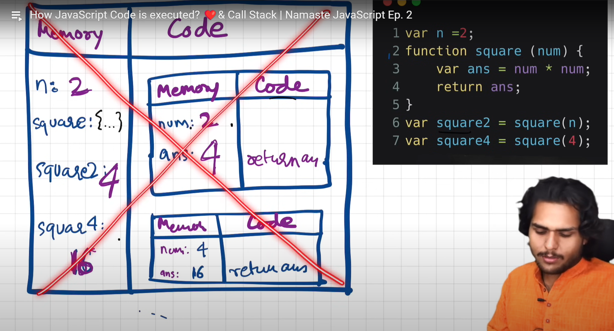

# Execution context

In JavaScript, an **execution context** is like an environment where JavaScript code is evaluated and executed. Whenever any code is run in JavaScript, it's run inside an execution context.

You can think of an execution context as a big box, or container, which stores variables and in which a piece of our code is evaluated and executed. The default context is the **global context**, which is accessible everywhere in your code.

There are three types of execution contexts in JavaScript:

1. **Global Execution Context (GEC)**: This is the default execution context. Any code that is not inside a function is in the global execution context. It creates two things for you: a global object (`window` in a browser) and a variable called `this`.

2. **Functional Execution Context (FEC)**: Whenever a function is invoked, a new execution context is created for that function. Each function has its own execution context.

3. **Eval Function Execution Context**: Code executed inside an `eval` function also gets its own execution context.

When JavaScript executes a function, it creates a new execution context and pushes it onto the top of the **execution stack**. The function at the top of the stack is the function currently being run. When it finishes, it gets popped off the stack, and control returns to the context below it on the stack.

## execution contexts in JavaScript Conatains:

Yes, you're on the right track!

1. **Variable Environment (Memory Component)**: This is essentially the same as the Variable Object I mentioned earlier. It's where all the variables and function declarations live. When an execution context is created during the creation phase, JavaScript engine scans for variable and function declarations and stores them inside the Variable Environment.

2. **Thread of Execution (Code Component)**: JavaScript is a `single-threaded language, which means it executes one operation at a time`, from top to bottom. It does this using something called a "call stack" (or "execution stack"). When a piece of code is run, a new execution context is created and added to the stack. If a function is called within that code, a new execution context is created for that function and added to the top of the stack. The JavaScript engine keeps track of where it's up to with a "thread of execution" that moves through the code, line by line.


# How JavaScript Code is executed?

In JavaScript, the creation of an execution context is a two-step process: the **Memory Creation Phase** (also known as the "Compilation" or "Creation" phase) and the **Code Execution Phase**.

During the **Memory Creation Phase**, the JavaScript engine does the following:

1. **Creates the Global Object**: In a browser, this is the `window` object. In Node.js, it's an object called `global`.

2. **Creates the `this` keyword**: It also creates a reference to the `this` keyword. In the global execution context, `this` refers to the global object.

3. **Sets up Memory Space for Variables and Functions**: **_The engine scans through the code and finds all variable and function declarations. For each variable, it creates a property on the Variable Object and sets its initial value to `undefined`. For each function declaration, it also creates a property on the Variable Object, but sets its value to the actual function object._**

4. **Determines the Scope Chain**: The scope chain of the execution context is determined, which is used for variable resolution.

This phase is completed before the code is actually executed. It's why you can use functions before they're declared in your code (a behavior known as "hoisting").

After the Memory Creation Phase is the Code Execution Phase, where the code is executed line by line.

# Visulaization by Example:


Every time a function is invoked (or called), a new execution context is created for that function. This execution context is pushed onto the execution stack (also known as the call stack), and becomes the active execution context.

This new execution context has its own Variable Environment (where it keeps its local variables and function declarations) and its own `this` reference. It also has access to its outer environment, which means it can access variables from the parent execution context.

Once the function finishes executing, its execution context is popped off the execution stack, and control returns to the execution context that is now on top of the stack (which could be the global context, or the context of another function if the current function was called from within that function).

This process allows each function call to have its own private space to execute and manage variables, without interfering with other function calls, even if the same function is called multiple times.





### Q.What is Hoisting in javaScript ?

- Hoisting is the phenomenon in JavaScript by which we can access variables and functions even before we initialize them.

```javascript
hoistedFunction(); // Outputs: "Hello, I have been hoisted!"

function hoistedFunction() {
  console.log("Hello, I have been hoisted!");
}
```

And for variables, they can be declared after they are used. But it's important to note that only the declarations are hoisted, not the initializations. If a variable is declared and initialized after using it, the value will be `undefined`:

```javascript
console.log(hoistedVar); // Outputs: undefined

var hoistedVar = "I am a variable";
```

In this case, the variable declaration `var hoistedVar;` is hoisted to the top, but the initialization `hoistedVar = "I am a variable"` happens in place, which is why the initial log outputs `undefined`.


### Q.What is meant by execution context in JavaScript?

- Execution context in JavaScript is the environment in which JavaScript code is executed. It contains information about the current scope, variables, and functions.

- Whenever any code is run in JavaScript, it's run inside an execution context.
  The default context is the global context, which is accessible everywhere in your code.

**There are two types of execution contexts in JavaScript:**

- **Global execution context:** This is the execution context for the global scope. It is created when the JavaScript engine starts up.

- **Function execution context:** This is the execution context for a function. It is created when the function is called.

### Q.What are the different Phases of the JavaScript Execution Context ?

There are two phases of JavaScript execution context:

- **Memory Creation Phase:** In this phase, the JavaScript engine creates a Memory area also called **"variable environment"** in the execution context . It determines the values of variables and functions and sets up a memory for storing variables and functions.

- **Code Execution phase:** In this phase, the JavaScript engine creates a Code Execution area, also called **"Thread of Execution,"** in the execution context. In this area, the JavaScript engine starts going through the entire code line by line from top to bottom and execute it.
  - As soon as it encounters variables, it assigns their values to the variables stored in memory.
  - When it encounters functions, JavaScript once again creates a new execution context for that function.

### Q.What is the Call Stack?

- To keep the track of all the Execution contexts, including global and functional, the JavaScript engine uses a call stack. A call stack is also known as an 'Execution Context Stack'.

- It uses the LIFO principle (Last-In-First-Out). When the engine first starts executing the script, it creates a global context and pushes it on the stack. Whenever a function is invoked, similarly, the JS engine creates a function stack context for the function and pushes it to the top of the call stack and starts executing it.
