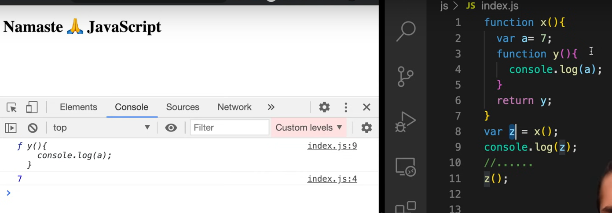
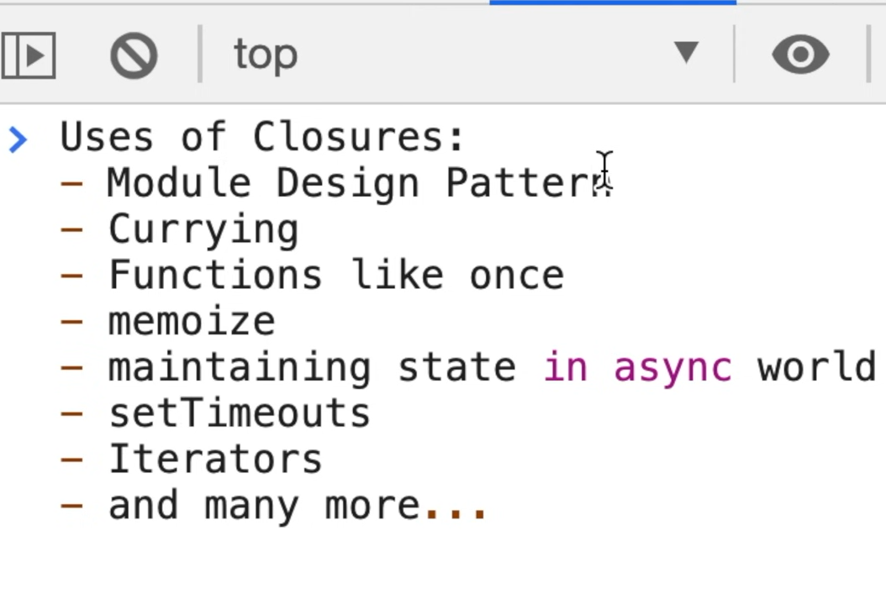

# closures

Sure, I'll explain closures in JavaScript in simple terms.

Imagine you have a function that creates another function inside it. This inner function can access the variables and parameters of the outer function, even after the outer function has finished running. This is what we call a closure.

Here's a simple example:

```javascript
function outerFunction(outerVariable) {
  return function innerFunction(innerVariable) {
    console.log("Outer variable:", outerVariable);
    console.log("Inner variable:", innerVariable);
  };
}

const closure = outerFunction("Hello");

closure("World");
```

In this example:

- `outerFunction` takes one parameter called `outerVariable`.
- Inside `outerFunction`, it defines another function `innerFunction`, which takes one parameter called `innerVariable`.
- `innerFunction` can access `outerVariable`, even though it's defined in the outer function.
- When we call `outerFunction("Hello")`, it returns `innerFunction`, creating a closure where `innerFunction` remembers the value of `outerVariable`.
- Later, when we call `closure("World")`, it prints both the value of `outerVariable` ("Hello") and `innerVariable` ("World") even though `outerFunction` has already finished executing.

In simple terms, a closure is like a backpack that an inner function carries with it wherever it goes, containing all the variables from its outer function that it might need later. It allows the inner function to access and use those variables even after the outer function has completed its execution.

# function along with its lexical scope bundle together form a `closure`.

### Example 1:
```js
function x() {
  var a = 7;
  function y() {
    console.log(a);
  }
  return y;
}
var z = x();
console.log(z);

//.....

z();
```
### Example 2:
```js
function outer(x) {
  let y = 10;

  function inner() {
    console.log(x + y);
  }

  return inner;
}

const fn = outer(5); 
fn(); 

```

This code is a great example of two important concepts in JavaScript: **lexical scoping** and **closures**.

Let's break it down:

1. **Lexical Scoping**: In JavaScript, the scope of a variable is determined by its location within the source code, and nested functions have access to variables declared in their outer scope.

   In your code, `y` is a function defined inside `x`, so `y` has access to variables declared in `x`. This is why `y` can access the variable `a` even though `a` is not defined inside `y`.

2. **Closures**: A closure is a function that has access to its own scope, the outer function's scope, and the global scope.

   Here, `x` returns the function `y`. When we call `x` and assign the result to `z`, `z` becomes a reference to the function `y`. The important part is that even though `x` has finished executing, `z` (which refers to `y`) still has access to `x`'s scope. This is a closure - `z` is a function that encapsulates its own scope and `x`'s scope, and can access variables from both.

So when you call `z()`, it's like calling `y()`. And because of closures and lexical scoping, `y` can still access the variable `a` from `x`'s scope, even though `x` has finished executing. That's why it logs `7` to the console.



```js

function z() {
  var b = 900;
  function x() {
    var a = 7;
    function y() {
      console.log(a, b);
    }
    y();
  }
  x();
}
z();
```

This code is a great example of **lexical scoping** and **closures** in JavaScript.

1. **Lexical Scoping**: In JavaScript, the scope of a variable is determined by its location within the source code. Functions that are nested within other functions have access to variables declared in their outer scope.

   In your code, `y` is a function defined inside `x`, and `x` is a function defined inside `z`. So, `y` has access to variables declared in `x` and `z`. This is why `y` can access the variables `a` and `b`, even though `a` is not defined inside `y` and `b` is not defined inside `x`.

2. **Closures**: A closure is a function that has access to its own scope, the outer function's scope, and the global scope.

   Here, `z` is invoked, which then invokes `x`, which then invokes `y`. Even though each function finishes executing after it's invoked, any function that's defined inside another function retains access to its parent function's variables. So when `y` is invoked, it still has access to `x`'s variable `a` and `z`'s variable `b`. This is a closure - `y` is a function that encapsulates its own scope, `x`'s scope, and `z`'s scope, and can access variables from all three.

So when you call `z()`, it's like calling `x()`, and then `y()`. And because of closures and lexical scoping, `y` can still access the variables `a` and `b` from `x`'s and `z`'s scopes, respectively, even though `x` and `z` have finished executing. That's why it logs `7` and `900` to the console.

### First, the. Outer function return the inner function, then the inner function invoked. Or the inner function invoked in between.

Excellent question 🙌 — this is the exact point where many learners get confused.
Let’s compare **two cases**:

---

## **Case 1: Outer returns inner, then we call inner later**

```js
function outer(x) {
  let y = 10;

  function inner() {
    console.log(x + y);
  }

  return inner; // 👈 returning inner
}

const fn = outer(5); // outer runs once
fn(); // inner runs later
```

👉 Flow:

1. `outer(5)` is called → it creates `x=5`, `y=10`, defines `inner`.
2. Instead of running `inner`, it **returns** it.
3. Now `fn` points to `inner`, which still has access to `x` and `y`.
4. When we call `fn()`, the closure works and logs `15`.

* **Important:** This is the classic **closure example** because outer has already finished, but inner still remembers its variables.

---

## **Case 2: Inner is invoked inside outer**

```js
function outer(x) {
  let y = 10;

  function inner() {
    console.log(x + y);
  }

  inner(); // 👈 directly calling inner here
}

outer(5);
```

👉 Flow:

1. `outer(5)` is called.
2. Inside outer, we immediately call `inner()`.
3. At this moment, outer is still running, so inner can access `x` and `y`.
4. Logs `15`.

* **Important:** This is **not closure in action** because `outer` hasn’t finished yet. Inner just uses the normal scope chain while outer is active.

---

## ✅ Difference in one line

* **Case 1 (return inner, then call later):** Closure → inner uses outer’s variables **after outer has finished**.
* **Case 2 (call inner inside outer):** Normal scope → inner uses outer’s variables **while outer is still running**.




### Q. What is Closure ?

- A function along with its lexical environment is collectively called a closure.

- A closure is a function that has access to its own scope, the outer function's scope, and the global scope.