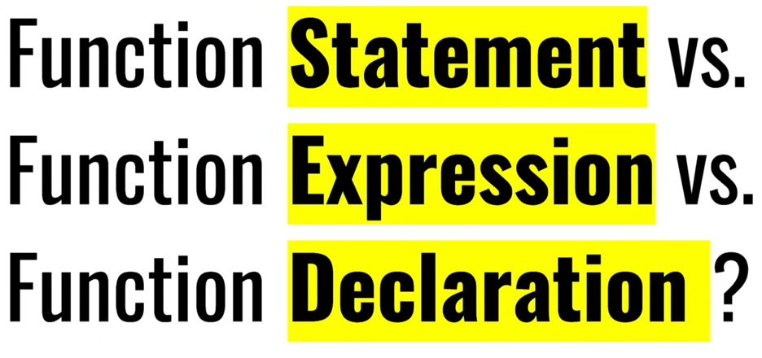
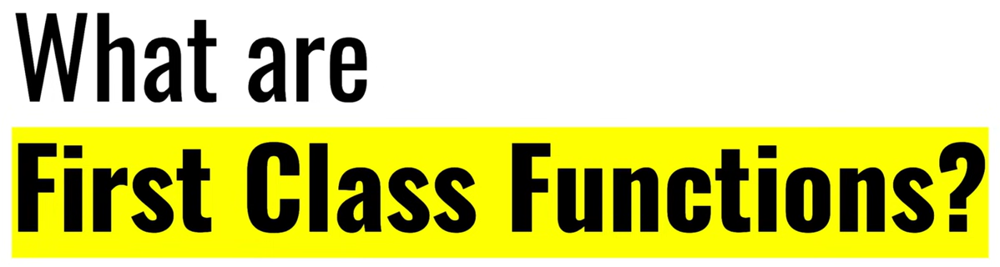

# Function Declaration / Statement

The syntax that we used is called a Function Declaration:

```js
function sayHi() {
  alert("Hello");
}
```

# Function expressions

```js
let sayHi = function () {
    alert("Hello");
};
```

As the function creation happens in the context of the assignment expression (to the right side of =), this is a Function Expression.

Here we immediately assign it to the variable, so the meaning of these code samples is the same: "create a function and put it into the variable sayHi".

Assigning the function to a variable is called Function Expression


# Anonymous function 

An anonymous function in JavaScript is a function that has no name, or more precisely, one that lacks a name

```javascript
(function () {
   //...
});
```

Note that if you don’t place the anonymous function inside the parentheses `()`, you’ll get a syntax error. The parentheses `()` make the anonymous function an expression that returns a function object.

An anonymous function is not accessible after its initial creation. Therefore, you often need to assign it to a variable.

For example, the following shows an anonymous function that displays a message:

```javascript
let show = function() {
    console.log('Anonymous function');
};

show();
```

In this example, the anonymous function has no name between the `function` keyword and parentheses `()`.

Because we need to call the anonymous function later, we assign the anonymous function to the `show` variable.

Since the whole assignment of the anonymous function to the `show` variable makes a valid expression, you don’t need to wrap the anonymous function inside the parentheses `()`.

### Using anonymous functions as arguments

In practice, you often pass anonymous functions as arguments to other functions. For example:

```javascript
setTimeout(function() {
    console.log('Execute later after 1 second')
}, 1000);
```

In this example, we pass an anonymous function into the `setTimeout()` function. The `setTimeout()` function executes this anonymous function one second later.


### Immediately Invoked Function Expression (IIFE)

If you want to create a function and execute it immediately after the declaration, you can declare an anonymous function like this:

```javascript
(function() {
    console.log('IIFE');
})();
```

**Output:**
```
IIFE
```

### How it works:

First, define a function expression:

```javascript
(function () {
    console.log('Immediately invoked function execution');
})
```
This expression returns a function.

Second, call the function by adding the trailing parentheses `()`:

```javascript
(function () {
    console.log('Immediately invoked function execution');
})();
```

Sometimes, you may want to pass arguments into an anonymous function, like this:

```javascript
let person = {
    firstName: 'John',
    lastName: 'Doe'
};

(function () {
    console.log(person.firstName + ' ' + person.lastName);
})(person);
```

**Output:**
```
John Doe
```

# Named function expression


In JavaScript, a named function expression is a function that is assigned to a variable and also has a name. Here's how it works:

1. **Definition**: A named function expression is a function that is assigned to a variable and also has a name¹. The syntax for a named function expression is as follows¹:

```javascript
var variableName = function functionName() {
  // Code here
};
```

2. **Scope of the Name**: The name of the function is only accessible within the function's body². This can be useful for recursion (when a function calls itself), among other things².

3. **Utility**: Named function expressions can be useful for several reasons¹:
   - They can be used for recursive calls or to remove event listeners¹.
   - When using named functions, call stacks and error messages will display more specific information¹. This can make debugging easier¹.
   - Naming a function can make the code more readable and clear¹.

4. **Example**: Here's an example of a named function expression that calculates the factorial of a number¹:

```javascript
var factorial = function fact(n) {
  if (n <= 1) {
    return 1;
  }
  return n * fact(n - 1);
};

console.log(factorial(5));  // Output: 120
```

In this example, `fact` is the name of the function, and it's used inside the function to call itself recursively¹. The function is assigned to the variable `factorial`, which is used to call the function¹.


# First class Functions:



When functions in a programming language are treated like any other variable then that programming language is known to have `first-class functions`. In `javascript`, the functions are known as the `first-class citizens`, which means functions can do what any other variables can. First-class functions javascript get this ability by treating the functions as an object.

As functions are treated like a variable, we can `pass` them as a parameter to the other function and `return` the function from another function just like any other variable. 

Because functions are treated as variables we can store them in any other variable, objects, and in an array. This simply means first-class functions in javascript are simply like values or like any other objects in the code.


Here's the content converted into Markdown format:


## Examples of First-Class Functions in JavaScript

### Example 1: Assign function to a variable

```javascript
const myVariable = function () { // Assigning a function to a variable
    console.log("Inside the function...");
}

myVariable(); // Invoking the function using the variable
```

**Output:**
```
Inside the function...
```

In this example, we declare a constant variable `myVariable` and assign a function to it. We can then use `myVariable` as a function and invoke it like any other function.

### Example 2: Pass function as an Argument

```javascript
function wishHappyNewYear() {
    return "Happy New Year, ";
}

function wishPerson(wishMessage, name) { 
   console.log(wishMessage() + name + '!!!');
}

wishPerson(wishHappyNewYear, "John Doe");
```

**Output:**
```
Happy New Year, John Doe!!!
```

Here, the `wishPerson` function takes another function `wishMessage` as a parameter and combines its return value with the provided name.

### Example 3: Return a function and call using another variable

```javascript
function sayHello() {
    return function() {
       console.log("Hello!");
    }
}

const newFun = sayHello();
newFun();
```

**Output:**
```
Hello!
```

In this example, we return a function from the `sayHello` function and then assign and call it using the variable `newFun`.

### Example 4: Return a function and call using double parentheses

```javascript
function sayHello() {
    return function() {
       console.log("Hello!");
    }
}

sayHello()();
```

**Output:**
```
Hello!
```

This example demonstrates function currying, where we return a function and immediately call it using double parentheses.

# Arrow Function

JavaScript arrow functions are a concise syntax for writing function expressions.

## Example: Arrow Function

```javascript
// an arrow function to add two numbers
const addNumbers = (a, b) => a + b;

// call the function with two numbers
const result = addNumbers(5, 3);
console.log(result);

// Output: 8
```

In this example, `addNumbers()` is an arrow function that takes two parameters, `a` and `b`, and returns their sum.

### Arrow Function Syntax

The syntax of the arrow function is:

```javascript
let myFunction = (arg1, arg2, ...argN) => {
    statement(s)
}
```

Here,

- `myFunction` is the name of the function.
- `arg1`, `arg2`, ... `argN` are the function arguments.
- `statement(s)` is the function body.

If the body has a single statement or expression, you can write the arrow function as:

```javascript
let myFunction = (arg1, arg2, ...argN) => expression
```

### Regular Function vs. Arrow Function

#### Example 1: Arrow Function With No Argument

If a function doesn't take any argument, then you should use empty parentheses. For example,

```javascript
const sayHello = () => "Hello, World!";

// call the arrow function and print its return value
console.log(sayHello());  

// Output: Hello, World!
```

In this example, when `sayHello()` is called, it executes the arrow function which returns the string `Hello, World!`.

#### Example 2: Arrow Function With One Argument

If a function has only one argument, you can omit the parentheses. For example,

```javascript
const square = x => x * x;

// use the arrow function to square a number
console.log(square(5));  

// Output: 25
```

The arrow function `square()` takes one argument `x` and returns its square.

Hence, calling `square()` with the value 5 returns 25.

### `this` Keyword With Arrow Function

Inside a regular function, `this` keyword refers to the function where it is called.

However, `this` is not associated with arrow functions. So, whenever you call `this`, it refers to its parent scope. For example,

```javascript
// constructor function
function Person() {

    this.name = 'Jack',
    this.age = 25,
    this.sayName = function () {

        console.log(this.age);

        let innerFunc = () => {
            console.log(this.age);
        }

        innerFunc();
    }
}

const x = new Person();
x.sayName();
```

**Output:**

```
25
25
```

Here, the `innerFunc()` function is an arrow function.

And inside the arrow function, `this` refers to the parent's scope, i.e., the scope of the `Person()` function. Hence, `this.age` gives 25.

# Callback Function

https://www.scaler.com/topics/callback-function-in-javascript/

# What is a Callback Function?

In JavaScript, functions are objects. Can we pass objects to functions as parameters? Yes.

_A callback function is a function passed into another function as an argument, which is then invoked inside the outer function to complete some kind of routine or action._

So, we can also pass functions as parameters to other functions and call them inside the outer functions. Sounds complicated? Let me show that in an example below:

```javascript
function print(callback) {  
    callback();
}
```

The `print()` function takes another function as a parameter and calls it inside. This is valid in JavaScript and we call it a “callback”. So a function that is passed to another function as a parameter is a callback function. But that’s not all.

## Why do we need Callback Functions?

JavaScript runs code sequentially in top-down order. However, there are some cases that code runs (or must run) after something else happens and also not sequentially. This is called asynchronous programming.

Callbacks make sure that a function is not going to run before a task is completed but will run right after the task has completed. It helps us develop asynchronous JavaScript code and keeps us safe from problems and errors.

In JavaScript, the way to create a callback function is to pass it as a parameter to another function, and then to call it back right after something has happened or some task is completed.

## How to create a Callback

To understand what I’ve explained above, let me start with a simple example. We want to log a message to the console but it should be there after 3 seconds.

```javascript
const message = function() {  
    console.log("This message is shown after 3 seconds");
}
 
setTimeout(message, 3000);
```

There is a built-in method in JavaScript called `setTimeout`, which calls a function or evaluates an expression after a given period of time (in milliseconds). So here, the `message` function is being called after 3 seconds have passed. (1 second = 1000 milliseconds)

In other words, the `message` function is being called after something happened (after 3 seconds passed for this example), but not before. So the `message` function is an example of a callback function.

## What is an Anonymous Function?

Alternatively, we can define a function directly inside another function, instead of calling it. It will look like this:

```javascript
setTimeout(function() {  
    console.log("This message is shown after 3 seconds");
}, 3000);
```

As we can see, the callback function here has no name and a function definition without a name in JavaScript is called as an “anonymous function”. This does exactly the same task as the example above.

## Callback as an Arrow Function

If you prefer, you can also write the same callback function as an ES6 arrow function, which is a newer type of function in JavaScript:

```javascript
setTimeout(() => { 
    console.log("This message is shown after 3 seconds");
}, 3000);
```

## What about Events?

JavaScript is an event-driven programming language. We also use callback functions for event declarations. For example, let’s say we want users to click on a button:

```html
<button id="callback-btn">Click here</button>
```

This time we will see a message on the console only when the user clicks on the button:

```javascript
document.queryselector("#callback-btn")
    .addEventListener("click", function() {    
      console.log("User has clicked on the button!");
});
```

So here we select the button first with its id, and then we add an event listener with the `addEventListener` method. It takes 2 parameters. The first one is its type, “click”, and the second parameter is a callback function, which logs the message when the button is clicked.

As you can see, callback functions are also used for event declarations in JavaScript.


### Q. What is First-Class Functions in JavaScript ?

- The Ability of function to be used as values and can be passed as an arguments to another function and can be returned from another function this ability is known as First-Class Functions.

### Q. What is callback Functions in JavaScript ?

- A callback function is a function passed into another function as an argument, which is then invoked inside the outer function to complete some kind of routine or action.

```javascript
setTimeout(function(){
 console.log("Timer");
},5000)

function x(y){
 console.log("x");
 y();
}

x(function y(){
    console.log("y");
});
```

**Output:**

```
x
y

Timer
```


[Interview question on callback](https://www.greatfrontend.com/questions/quiz/what-are-callback-functions-and-how-are-they-used)