# Eventloop in JavaScript RunTime Environment:

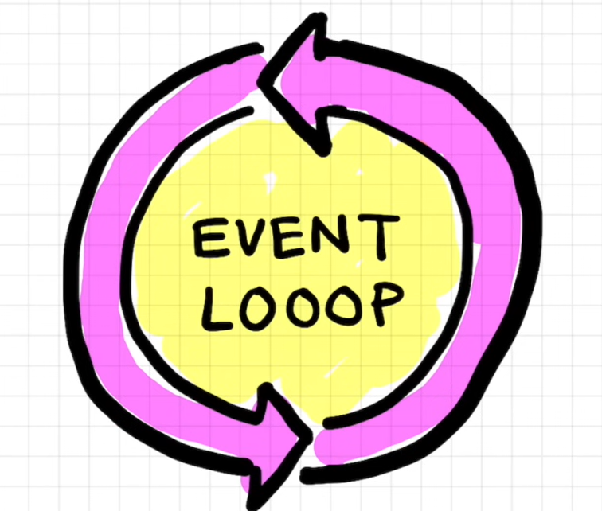

# Different components of a web browser:

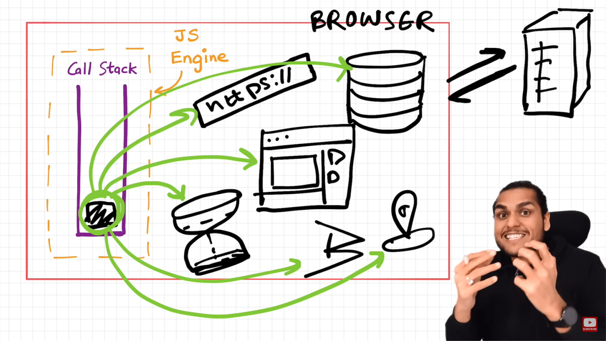

here are the basic components of a web browser:

1. **Storage**: The storage component is a persistence layer that is used by the browser to store all sorts of information locally, like cookies⁵⁶. A browser also supports different storage mechanisms such as IndexedDB, WebSQL, localStorage, and FileSystem⁶⁹. Web Storage is what the JavaScript API browsers provide for storing data locally and securely within a user’s browser⁸.

2. **Geolocation**: The Geolocation interface represents an object able to programmatically obtain the position of the device¹². It gives Web content access to the location of the device¹³. This allows a website or app to offer customized results based on the user's location[^10^]¹¹¹⁴.

3. **Timer**: While there isn't a specific "timer" component in a web browser, JavaScript provides several methods to control the timing of events, such as `setTimeout()`, `setInterval()`, and `requestAnimationFrame()`. These can be used to create timers, animations, and other time-based functions¹⁸. Additionally, web components can be created that render a timer¹⁶.

4. **JavaScript Interpreter**: It is a unit used to parse and execute the JavaScript code in a web page⁶¹⁵.

5. **Networking Layer**: This layer handles the communication part. When the user enters or clicks on a URL, the network layer initiates an HTTP request to the webserver to load the requested web page⁶¹⁵.

6. **Rendering Engine**: It is the unit responsible for rendering/displaying the requested content on the browser window⁶¹⁵.

7. **Browser Engine**: This unit handles the interactions between the user interface and the rendering engine⁶¹⁵.

8. **User Interface**: This unit includes things that are specific to each type of browsers and are not created by the web. It defines the layout of elements available for user to interact in the browser window except for the web page itself⁶¹⁵.

Each of these components has its own role in the functioning of a web browser. They work together to provide a seamless web browsing experience⁶¹⁵.

# Web Browser APIs

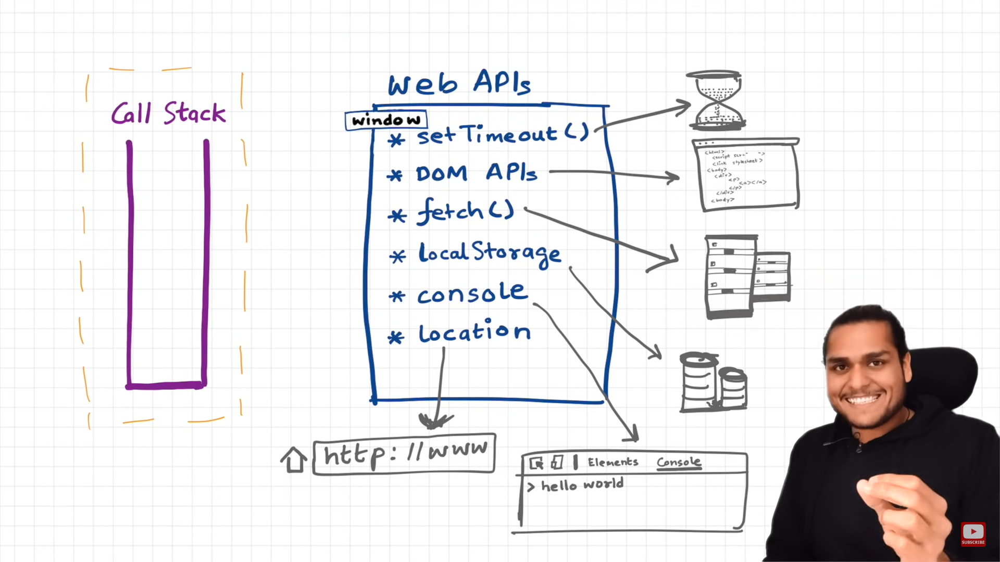

Browser Web APIs, also known as Web APIs, are built into your web browser and provide various features that can be used in a web application¹²³⁴. They are like a set of instructions that allow your web application to use the functionalities of the web browser¹²³⁴.

For example, the Web Audio API provides JavaScript constructs for manipulating audio in the browser — taking an audio track, altering its volume, applying effects to it, etc¹. Similarly, the Geolocation API can return the coordinates of where the browser is located².

These APIs greatly simplify complex functions and provide easy syntax to complex code². They allow you to do things like making network requests, managing client-side storage, retrieving device media streams, and much more⁴.

In simple terms, Browser Web APIs act as a bridge between your web application and the browser, enabling them to work together and perform various tasks seamlessly¹²³⁴. So, they are like a toolkit that helps you build and enhance your web applications¹²³⁴.

- **Console API**: Provides functionality to log information associated with a web page: error messages, warnings, etc.
- **DOM (Document Object Model) API**: Allows you to manipulate the structure, style, and content of a document.
- **Fetch API**: Provides an interface for fetching resources across the network.
- **Geolocation API**: Allows the user to provide their location to web applications if they so desire.
- **History API**: Provides access to the browser session history.
- **Storage API**: Provides mechanisms by which browsers can store key/value pairs, in a much more intuitive fashion than using cookies.
- **Web Audio API**: Allows you to manipulate audio on the web.

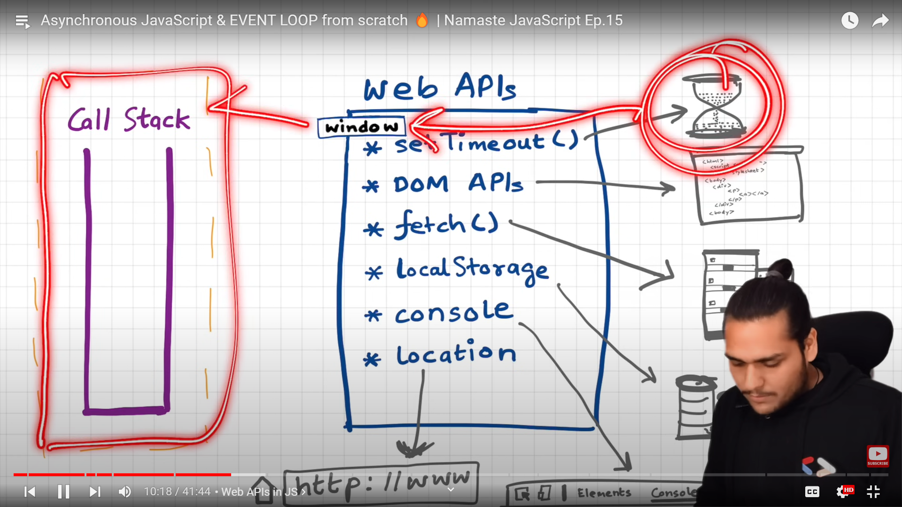

The `window` object in JavaScript is a global object that represents the browser window. It's the topmost object in the Browser Object Model (BOM), and it contains other objects that tell you about the browser's current state¹.

The `window` object includes a wide variety of methods and properties that allow you to interact with the environment of the web browser¹. For example, you can use the `window` object to change the location of the webpage, to manipulate cookies, to create pop-ups, to get the size of the browser window, and so on¹.

Web APIs are often attached to the `window` object, making them globally accessible to your scripts without needing to use `import` statements¹. For example, the Fetch API can be accessed using `window.fetch()`, the Geolocation API can be accessed using `window.navigator.geolocation`, and the Local Storage API can be accessed using `window.localStorage`¹.

However, it's important to note that not all Web APIs are available on the `window` object in all contexts. For instance, Web Workers run in a different global scope, `WorkerGlobalScope`, which doesn't have access to the `window` object³.

So, while the `window` object is a primary means of interacting with the web browser and its Web APIs, the availability of specific APIs can depend on the context in which your code is running¹³.

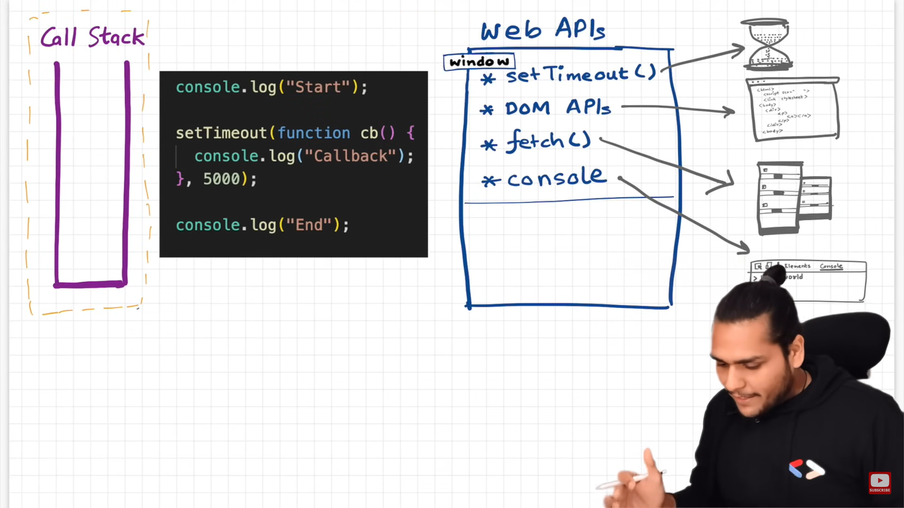
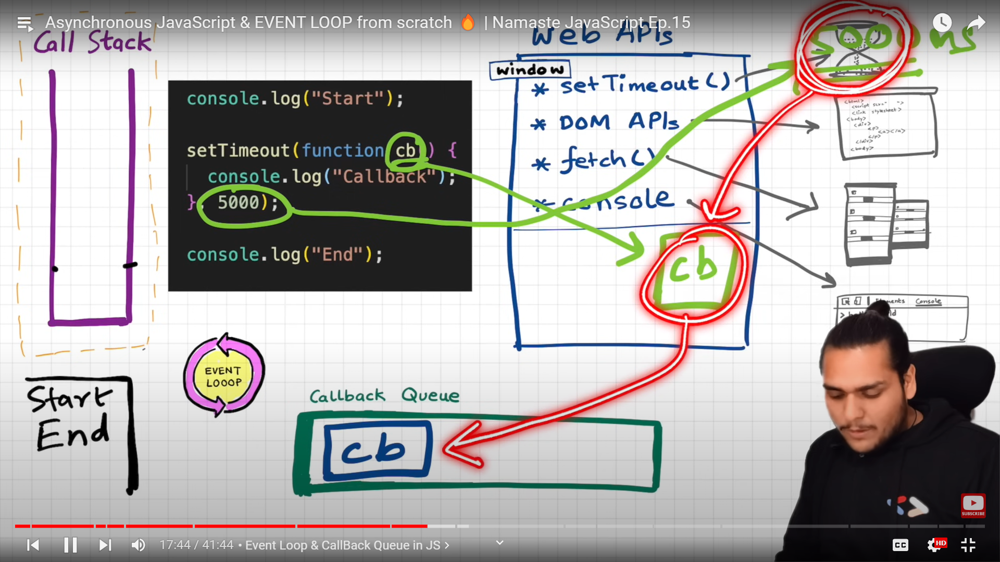
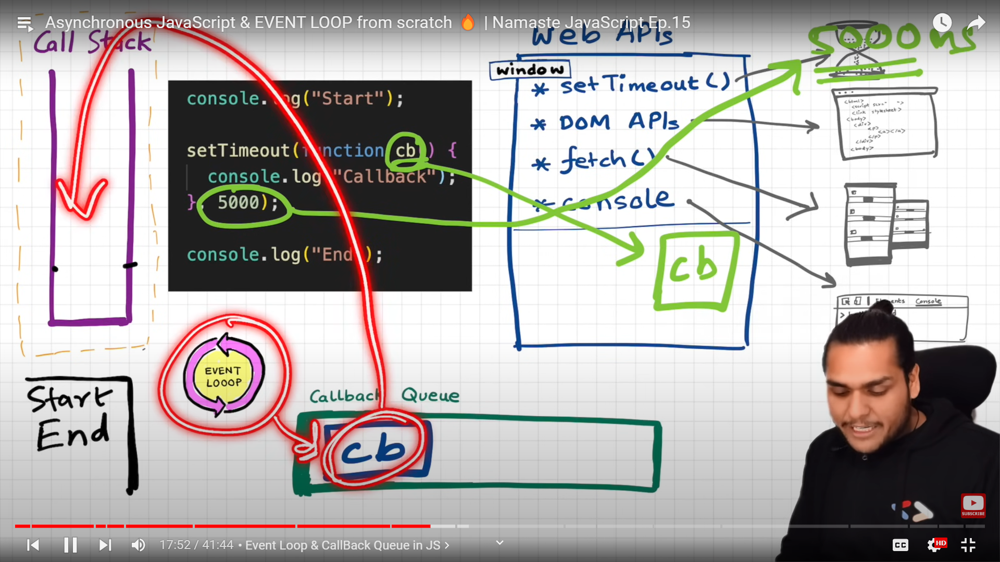

Sure, let's break down the execution of this JavaScript code in terms of the browser runtime environment:

1. **Call Stack**: The call stack is a data structure that keeps track of where we are in the program². It runs in a last-in, first-out way².

2. **Web APIs**: These are built-in libraries that can be accessed by your JavaScript code². They provide various features that can be used in a web application².

3. **Callback Queue**: This is a data structure that stores all the callback functions that are ready to be executed².

4. **Event Loop**: The event loop takes functions from the callback queue and pushes them onto the call stack when the call stack is empty².

Now, let's see how these components interact during the execution of your code:

1. When the JavaScript engine starts executing your code, it first encounters the `console.log("Start")` statement. This is pushed onto the call stack and executed immediately, logging "Start" to the console².

2. Next, it encounters the `setTimeout` function. This function is part of the Web APIs provided by the browser². The callback function `cb` and the delay of `5000` milliseconds are passed to the `setTimeout` function and it starts the timer².

3. When the `setTimeout` function is called, it registers the callback function in the Web APIs area, not the call stack. The Web APIs handle the timer. When the timer expires (after 5000 milliseconds in your code), the callback function is moved to the Callback Queue. The Event Loop then checks if the call stack is empty. If it is, the Event Loop takes the callback function from the Callback Queue and pushes it onto the Call Stack for execution. Thank you for pointing out the error, and I appreciate your understanding.

4. The JavaScript engine then encounters the `console.log("End")` statement. This is pushed onto the call stack and executed immediately, logging "End" to the console².

5. After `5000` milliseconds (or 5 seconds), the timer finishes. At this point, the callback function `cb` is placed in the callback queue².

6. The event loop constantly checks if the call stack is empty². Once it sees that the call stack is empty, it takes the callback function from the callback queue and pushes it onto the call stack².

7. Finally, the `console.log("callback")` statement inside the callback function is executed, logging "callback" to the console².

So, the output of your code will be:

```
Start
End
callback
```

This is a great example of how JavaScript handles asynchronous operations². Even though the `setTimeout` function was encountered before `console.log("End")`, its callback wasn't executed until after because of the delay and the nature of the event loop².

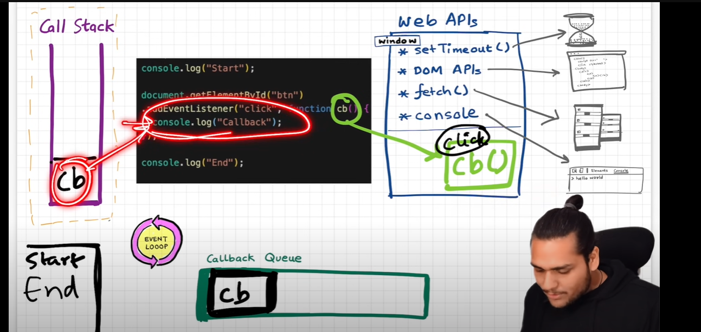
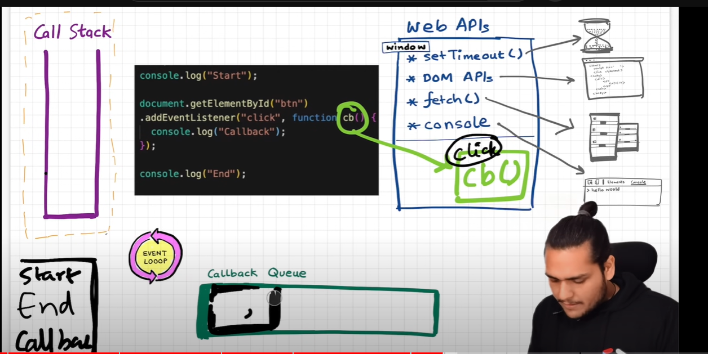

let's see how these components interact during the execution of your code:

1. When the JavaScript engine starts executing your code, it first encounters the `console.log("Start")` statement. This is pushed onto the call stack and executed immediately, logging "Start" to the console².

2. Next, it encounters the `document.getElementById("btn").addEventListener("click", function cb() {...})` statement. This is a Web API provided by the browser². The callback function `cb` is registered in the Web APIs area, not the call stack². The Web APIs handle the click event². When the click event occurs (i.e., when the user clicks the button with the id "btn"), the callback function `cb` is placed in the Callback Queue².

3. Meanwhile, the `addEventListener` function itself finishes executing and is removed from the call stack².

4. The JavaScript engine then encounters the `console.log("End")` statement. This is pushed onto the call stack and executed immediately, logging "End" to the console².

5. The Event Loop constantly checks if the call stack is empty². Once it sees that the call stack is empty, it takes the callback function from the Callback Queue and pushes it onto the Call Stack for execution². However, this will only happen when the user clicks the button with the id "btn" and the callback function `cb` is placed in the Callback Queue².

6. Finally, when the user clicks the button, the `console.log("Callback")` statement inside the callback function is executed, logging "Callback" to the console².

So, the output of your code will be:

```
Start
End
Callback
```

And "Callback" will be logged to the console when the button is clicked². This is a great example of how JavaScript handles asynchronous operations². Even though the `addEventListener` function was encountered before `console.log("End")`, its callback wasn't executed until after because of the nature of the event loop².

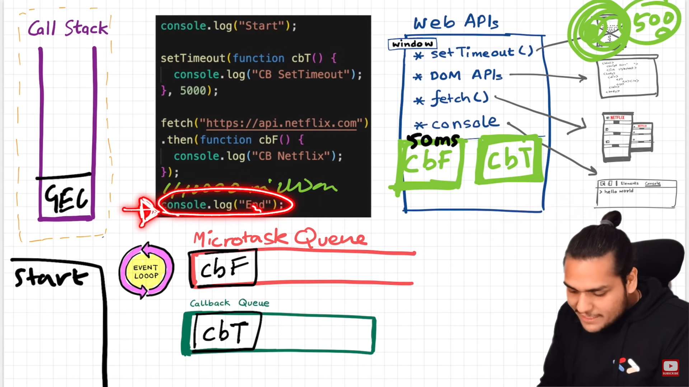
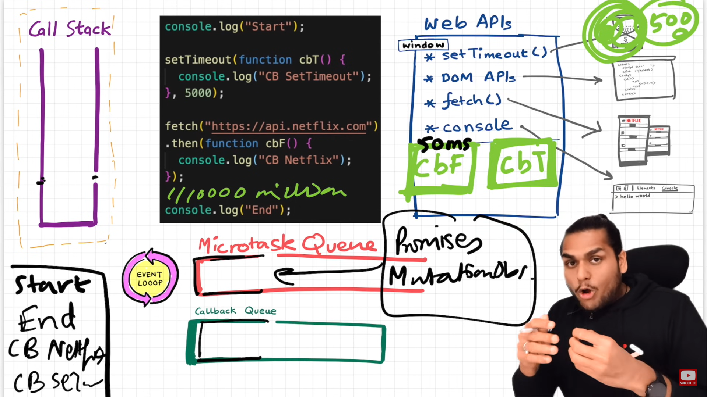


let's see how these components interact during the execution of your code:

1. When the JavaScript engine starts executing your code, it first encounters the `console.log("Start")` statement. This is pushed onto the call stack and executed immediately, logging "Start" to the console².

2. Next, it encounters the `setTimeout` function. This function is part of the Web APIs provided by the browser². The callback function `cbT` and the delay of `5000` milliseconds are passed to the `setTimeout` function and it starts the timer².

3. Meanwhile, the `setTimeout` function registers the callback function in the Web APIs area, not the call stack. The Web APIs handle the timer. When the timer expires (after 5000 milliseconds in your code), the callback function is moved to the Callback Queue. 

4. The JavaScript engine then encounters the `fetch` function. This function is also part of the Web APIs provided by the browser². The fetch request is made to "https://api.netflix.com",at this point the JavaScript engine first register the `cbF` in callback register  and once the response is received, the callback function `cbF` is placed in the Microtask Queue².


6. The JavaScript engine then encounters the `console.log("End")` statement. This is pushed onto the call stack and executed immediately, logging "End" to the console².

7. After `5000` milliseconds (or 5 seconds), the timer finishes. At this point, the callback function `cbT` is placed in the Callback Queue².

8. The Event Loop constantly checks if the call stack is empty². Once it sees that the call stack is empty, it first checks the Microtask Queue². If there are any tasks in the Microtask Queue, it takes the first task from the Microtask Queue and pushes it onto the Call Stack². In this case, the callback function `cbF` is pushed onto the call stack and executed, logging "CB Netflix" to the console².

9. Once the Microtask Queue is empty, the Event Loop checks the Callback Queue². If there are any tasks in the Callback Queue, it takes the first task from the Callback Queue and pushes it onto the Call Stack². In this case, the callback function `cbT` is pushed onto the call stack and executed, logging "CB SetTimeout" to the console².

So, the output of your code will be:

```
Start
End
CB Netflix
CB SetTimeout
```

This is a great example of how JavaScript handles asynchronous operations². Even though the `setTimeout` and `fetch` functions were encountered before `console.log("End")`, their callbacks weren't executed until after because of the nature of the event loop².

# Priority of Microtask Queue and the Callback Queue:

the Microtask Queue does have a higher priority than the Callback Queue in the JavaScript runtime environment¹²³⁴.

When the Call Stack is empty, the Event Loop checks the queues for tasks to execute¹²³⁴. It first checks the Microtask Queue¹²³⁴. If there are any tasks in the Microtask Queue, it takes the first task from the Microtask Queue and pushes it onto the Call Stack¹²³⁴. The JavaScript engine then executes all the tasks from the Microtask Queue before it starts executing tasks from the Callback Queue¹²³⁴.

This means that if both the Microtask Queue and the Callback Queue have tasks waiting to be executed, the tasks in the Microtask Queue will be executed first¹²³⁴. This is because the Microtask Queue has a higher priority¹²³⁴.


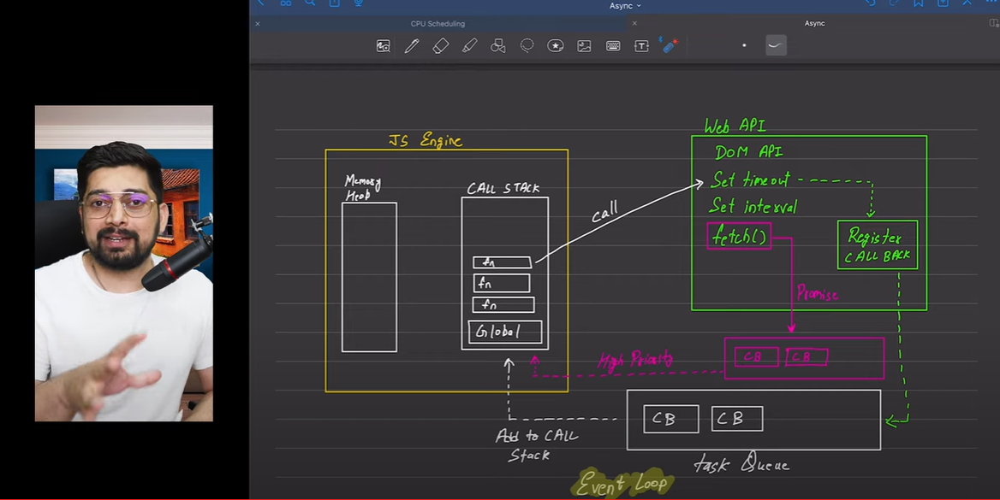

[Event loop interview question](https://medium.com/@a35851150/interview-qustions-on-event-loop-in-js-901c567a1271)

[A Nice Blog interview question](https://sonnet.js.org/blog/call-stack-and-callback-queue-in-js/)

[A Nice Blog Micro Task Queue](https://github.com/yangshun/top-javascript-interview-questions/blob/main/questions/explain-the-concept-of-a-microtask-queue/en-US.mdx)


### Q. What is Callback Queue ?

- The Callback Queue is a data structure that holds a queue of functions to be executed. When a function is invoked and its operation is asynchronous, it is added to the Callback Queue instead of blocking the execution of other code. This means that while the asynchronous operation is in progress, other code can continue to execute without interruption.

- The Callback Queue maintains the order in which the functions are added. The first function to be added to the queue will be the first to be executed when the Call Stack is empty. This ensures that the functions are executed in the order they were added to the Callback Queue.

### Q.What is the Call Stack?

- To keep the track of all the Execution contexts, including global and functional, the JavaScript engine uses a call stack. A call stack is also known as an 'Execution Context Stack'.

- It uses the LIFO principle (Last-In-First-Out). When the engine first starts executing the script, it creates a global context and pushes it on the stack. Whenever a function is invoked, similarly, the JS engine creates a function stack context for the function and pushes it to the top of the call stack and starts executing it.

### 1. **What is the Event Loop in JavaScript?**

- The Event Loop is a mechanism in JavaScript that handles asynchronous operations by continuously checking the message queue for pending tasks and executing them when the call stack is empty, ensuring non-blocking behavior.
