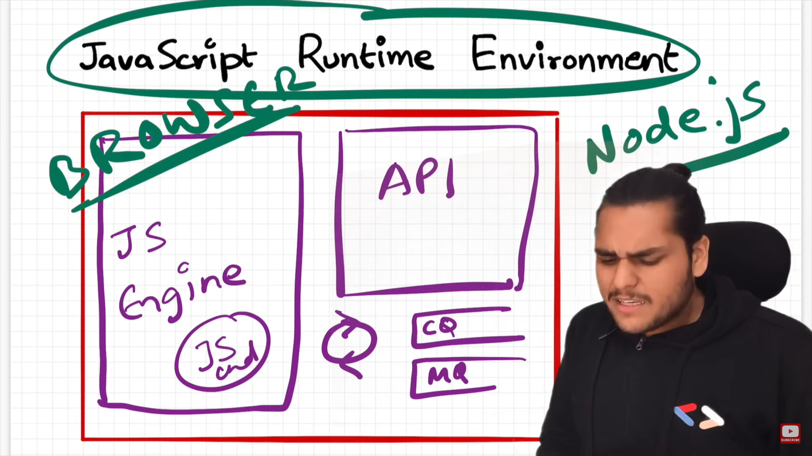
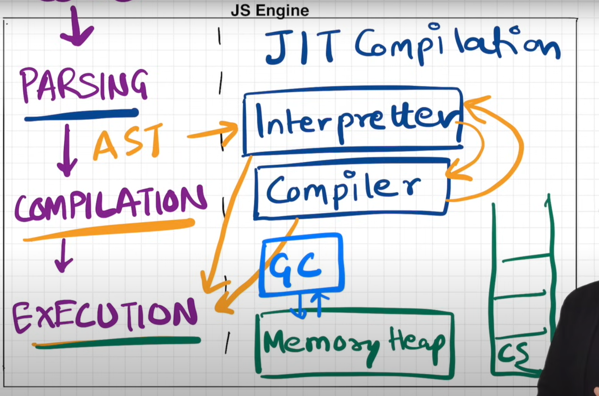
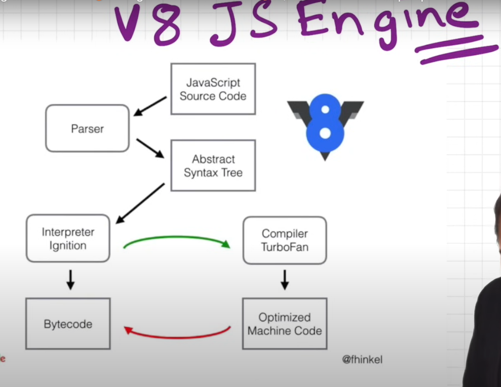

# JavaScript RunTime Environment:

# working principle of a JavaScript engine in easy language:

1. **Parsing**: When you write JavaScript code and run it in your browser, the first thing that happens is that the JavaScript engine reads, or "parses", your code¹². During this stage, the engine checks if the syntax of your code is correct¹². If there are any syntax errors, the engine will throw an error and stop the execution¹².

2. **Abstract Syntax Tree (AST)**: After parsing, the JavaScript engine converts your code into a data structure called an Abstract Syntax Tree (AST)¹². This tree represents the structure of your code¹². Each node in the tree corresponds to a construct occurring in your code¹².

3. **Compilation**: The next step is the compilation stage¹². The JavaScript engine takes the AST and compiles it into bytecode¹². Bytecode is like a set of instructions that can be executed by a computer¹².

4. **Optimization**: While the bytecode is being executed, the JavaScript engine also tries to optimize it¹². It uses various techniques to make your code run faster¹². For example, it might change the bytecode for a frequently used function to make it run faster¹².

5. **Execution**: Finally, the JavaScript engine executes the bytecode¹². It goes through each instruction in the bytecode and performs the corresponding operation¹².

So, in simple terms, the JavaScript engine reads your code, checks it for errors, converts it into a form that a computer can understand, tries to make it run faster, and then executes it¹². This all happens in a fraction of a second¹².

# Process of parsing in JavaScript engine :

1. **Reading the Code (Lexical Analysis)**: The first step in parsing is reading the code¹²³⁴. The syntax parser in JavaScript engine reads your code line by line, character by character¹²³⁴. This process is also known as lexical analysis¹²³⁴.

2. **Breaking Down the Code into Tokens**: During lexical analysis, the ensyntax parser breaks down your code into small pieces called tokens¹²³⁴. Each token represents a piece of the code that makes sense on its own¹²³⁴. For example, in the JavaScript code `let x = 10;`, the tokens would be `let`, `x`, `=`, `10`, and `;`¹²³⁴.

3. **Creating an Abstract Syntax Tree (AST)**: After breaking down your code into tokens, the syntax parser in JavaScript engine uses these tokens to create a data structure called an Abstract Syntax Tree (AST)¹²³⁴. The AST represents the structure of your code¹²³⁴. Each node in the tree corresponds to a token¹²³⁴.

4. **Checking Syntax**: While creating the AST, the syntax parser in JavaScript engine also checks if your code follows the syntax rules of the language¹²³⁴. If there are any syntax errors, the engine will throw an error and stop the execution¹²³⁴.

So, in simple terms, parsing is the process where the JavaScript engine reads your code, breaks it down into small pieces (tokens), uses these tokens to create a tree-like structure (AST) that represents your code, and checks if your code follows the syntax rules of the language¹²³⁴.

## Generate AST https://astexplorer.net/

# JIT compilation:

JavaScript is primarily an interpreted language, but it also has characteristics of a compiled language¹²³⁴.

As an interpreted language, JavaScript code is typically executed line by line by a JavaScript engine in the browser or on the server (in the case of Node.js)¹²³⁴. The engine reads and executes each line of code one at a time¹²³⁴.

However, modern JavaScript engines like V8 (used in Google Chrome and Node.js) use a technique called Just-In-Time (JIT) compilation to improve performance¹²³⁴. With JIT compilation, the JavaScript engine compiles the entire code into machine code just before it executes it¹²³⁴. This allows the engine to optimize the code for better performance¹²³⁴.

So, while JavaScript is traditionally known as an interpreted language, it also has some characteristics of a compiled language due to the use of JIT compilation¹²³⁴.

**_concept of Just-in-Time (JIT) Compilation in JavaScript:_**

Just-in-Time (JIT) Compilation is like a smart chef in a restaurant¹²³⁴⁵. Imagine you're in a restaurant where the chef only starts cooking your meal when you order it¹²³⁴⁵. This way, the chef can make sure your meal is fresh and hot when it's served¹²³⁴⁵.

In the same way, with JIT Compilation, the JavaScript engine only compiles the code into machine code when it's about to be executed¹²³⁴⁵. This is different from traditional compiled languages like C or C++, where the entire code is compiled before it's run¹²³⁴⁵.

The advantage of JIT Compilation is that it allows the JavaScript engine to optimize the code while it's running¹²³⁴⁵. For example, if a certain function is being called many times, the engine can optimize that function to make it run faster¹²³⁴⁵.

So, in simple terms, Just-in-Time Compilation is a process where the JavaScript engine compiles the code just when it's needed, which allows it to optimize the code for better performance¹²³⁴⁵.

# Execution Phase :

let's break down the Execution phase of the JavaScript engine:

1. **Bytecode Execution**: The JavaScript engine has a component called the interpreter that goes through the bytecode, line by line¹²³⁴. You can think of bytecode as a set of instructions that tell the computer what to do¹²³⁴. Each line of bytecode is an instruction¹²³⁴.

2. **Call Stack**: The call stack is like a to-do list for the JavaScript engine¹²³⁴. When the engine encounters a function call in the bytecode, it adds that function to the call stack¹²³⁴. The engine then starts executing the function¹²³⁴. Once the function is done, it's removed from the call stack¹²³⁴.

3. **Heap**: The heap is where the JavaScript engine stores all the variables and function declarations¹²³⁴. When the engine encounters a variable or function declaration in the bytecode, it adds that variable or function to the heap¹²³⁴.

4. **Garbage Collection**: JavaScript has a built-in garbage collector¹²³⁴. This means that when a variable or function is no longer needed, the garbage collector automatically removes it from the heap to free up memory¹²³⁴.

So, in simple terms, during the Execution phase, the JavaScript engine reads the bytecode, executes the instructions one by one, keeps track of the functions it needs to execute using the call stack, stores variables and functions in the heap, and cleans up unused variables and functions with the garbage collector¹²³⁴.

## Mark-and-Sweep algorithm¹²³⁴⁵.

Here's how it works in simple terms:

1. **Mark Phase**: Imagine you're cleaning your room. You first go around and put a sticky note on all the items you want to keep¹²³⁴⁵. In the Mark phase, the Garbage Collector does something similar. It goes through all the objects in memory and marks the ones that are still being used¹²³⁴⁵.

2. **Sweep Phase**: After you've marked all the items you want to keep, you then remove all the items that don't have a sticky note¹²³⁴⁵. In the Sweep phase, the Garbage Collector does the same thing. It removes all the unmarked objects from memory¹²³⁴⁵.

So, in simple terms, the Mark-and-Sweep algorithm used by the Garbage Collector first marks all the objects that are still in use, and then removes all the unmarked objects¹²³⁴⁵. This helps to free up memory that is no longer needed, making your JavaScript code run more efficiently¹²³⁴⁵.

# Google V8 Engine Architecture:

