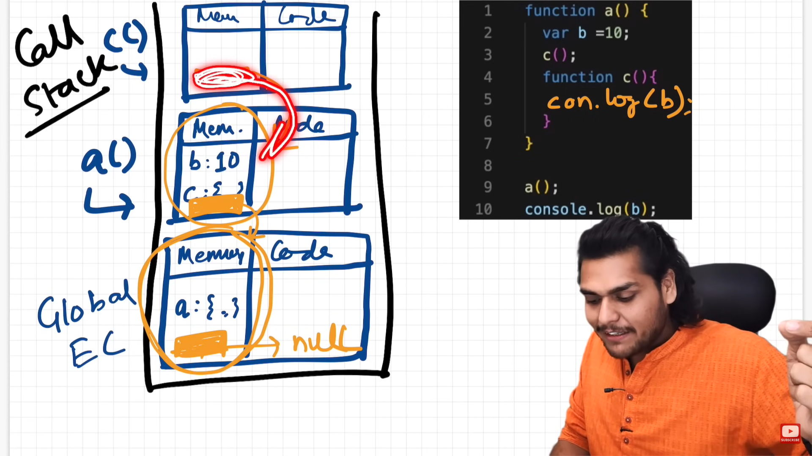

# lexical environment

Sure, let's simplify "lexical environment" in easy language:

Imagine you're working on a project. Each time you start a new task, you set up your environment: you gather your tools, like pens, paper, and computer, and arrange them around you. This setup helps you focus on that specific task.

In JavaScript, when you run a piece of code (like a function), it creates a similar environment called a "lexical environment." Here's how it works:

1. **Variables and Functions Setup**: Just like gathering your tools, JavaScript gathers all the variables and functions used in that code and sets them up in the environment.

2. **Keeps Track of Everything**: The lexical environment keeps track of all these variables and functions, as well as their values and where they were defined.

3. **Contextual Bubble**: You can think of it as a bubble that surrounds your code. Inside this bubble, your code can access and use the variables and functions it needs.

4. **Fixed During Execution**: Once this environment is set up, it stays the same while your code runs. Even if you call a function multiple times, each call creates its own lexical environment, keeping things separate and organized.

5. **Closure Support**: If there are nested functions (functions defined within other functions), each function gets its own lexical environment, and inner functions can access variables from their outer functions.

So, a "lexical environment" in JavaScript is like a personalized workspace for your code, where it gathers and organizes all the tools (variables and functions) it needs to do its job, keeping everything tidy and accessible.


# Scope chain 

Certainly! Imagine you have a bunch of rooms in a house, and each room has its own set of things (like toys, books, etc.). Each room can also see into the room it's connected to. 

Now, let's say you're looking for a particular toy. You start by searching in your room. If it's not there, you ask the next room if they have it. If they don't, they ask the next room, and so on until someone says they have it or until you've checked every room.

In JavaScript, when you're looking for a variable, it's similar. Each function you write is like a room, and each room can "see" into the rooms it's connected to. This line of connected rooms is called the "scope chain."

So, when you ask for a variable in a function, JavaScript first checks that function's "room" (scope). If it's not there, it goes to the next "room" (the next level of scope), and so on, until it finds the variable or reaches the end of the chain.

This helps JavaScript keep track of where variables are defined and where they can be used, just like you'd keep track of where your toys are in different rooms of your house.


# Summary

### Lexical environment is created whenever a scope is created

In JavaScript, whenever an execution context is created, a **lexical environment** is also created. The lexical environment is a data structure that holds variable and function declarations. It's used by the JavaScript engine to look up variables and functions at runtime.

The lexical environment consists of two main components:

1. **Environment Record**: This is where all the variables and function declarations live. It's essentially a record of all the variables and functions that are available within the current scope.

2. **Reference to the Outer Environment**: This is a reference to the lexical environment of the parent scope, i.e., the scope that is one level outside the current scope. This is what enables JavaScript's lexical (or static) scoping, allowing you to access variables declared outside the current function.

So, every time a function is invoked and a `new execution context is created, a corresponding lexical environment is created and attached to that execution context`. This lexical environment is used to resolve variable and function references during the execution of the function.


Lexical environment is the local memory + refrence to the  the lexical environment of parent



```js
function outer() {
  const x = 10;
  function inner() {
    console.log(x); // Accesses x via the outer reference
  }
  inner();
}
outer();


```

# Interview Question:

### Q. What is the Scope/Lexical Scope of a variable in JavaScript?

- The scope of a variable in JavaScript is the part of the code where the variable can be accessed. 

There are two types of scope in Js local and global:

- **Global Scope:** Variables declared Globally (outside of any function) have Global Scope and Global variables can be accessed from anywhere in a program.

- **Local Scope:** Variables declared inside a function become local to the functions which means that they can only be accessed  inside that function.


