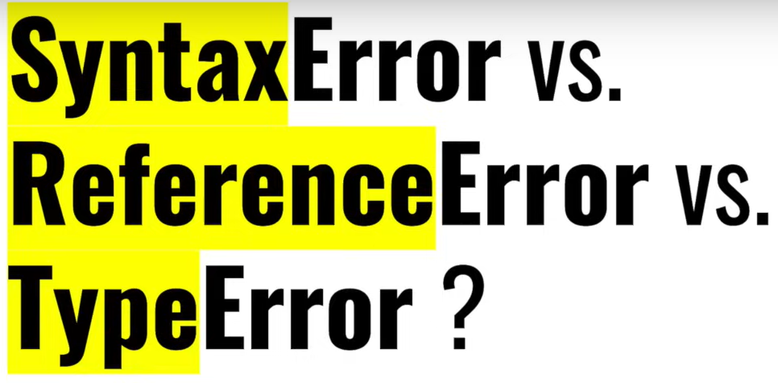
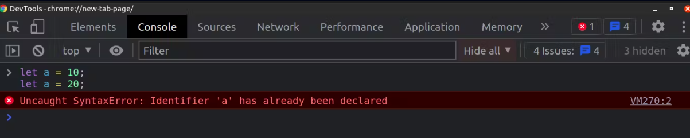

# Understanding the "Temporal Dead Zone" (TDZ) in JavaScript

1. **Declaration vs. Initialization**: In JavaScript, when you declare a variable using `let` or `const`, there's a step between declaring the variable and actually assigning a value to it. This step is called initialization.

2. **Temporal Dead Zone**: The Temporal Dead Zone (TDZ) is the period between the declaration of a variable and its initialization. During this time, if you try to access the variable, JavaScript will throw a ReferenceError.

3. **Why "Temporal"?**: "Temporal" means relating to time. The TDZ is called "temporal" because it exists in the time between when a variable is declared and when it's initialized.

4. **Why "Dead Zone"?**: It's called a "dead zone" because during this period, the variable exists, but it's in an unusable state. You can't access it or do anything with it until it's initialized.

5. **Example**:

   ```javascript
   console.log(x); // ReferenceError: Cannot access 'x' before initialization
   let x = 10; // Variable declaration

   // In this example, we're trying to access the variable 'x' before it's initialized.
   // This causes a ReferenceError because 'x' is in the Temporal Dead Zone.
   ```

In summary, the Temporal Dead Zone in JavaScript is the period between declaring a variable and initializing it, during which the variable is in an inaccessible state. Trying to access it during this period results in a ReferenceError.


https://dev.to/riyadhossain/different-hoisting-behaviour-between-var-let-const-3io5

In JavaScript, all the variables declared with var, let, and const keywords are hoisted to the top. However, many think variables using let and const keywords are not hoisted because it throws an error if trying to access those variables(declared with let and const) before initialization. In this blog, I'll try to demonstrate the exact reason for the such different behavior of hoisting.

Because of `Temporal Dead Zone`
Variables (declared with var) are hoisted with a default initialization which is undefined. That’s why if we try to access a variable (with the var keyword), it’ll not throw an error. Rather, it’ll give us undefined.
On the other hand, variables using (let and const) also do hoist but without a default initialization. That’s why accessing before initialization a variable (with let and const) will throw a reference error. It’s also known as the temporal dead zone where compilers know its existence but can’t access it because it’s uninitialized.



# SyntaxError ReferenceError TypeError

## `SyntaxError`: Raised when a syntax error occurs while parsing JavaScript code.

```js
let a = 10;
let a = 20;
```

Javascript will throw an error like this,


In the above example, we declaring the variable a two times in the same scope, which is not allowed in javascript syntax because a variable with the same name has already been declared.

## ReferenceError

A `ReferenceError` occurs when you try to use a variable that doesn't exist at all.

## TypeError

A `TypeError` occurs when the variable exists, but the operation you're trying to perform is not appropriate for the type of value it contains. If you are trying to reassign a value to a constant variable.

[function and block scope](https://codedamn.com/news/javascript/difference-between-let-and-var-in-javascript)

### Q. Difference between var and let keyword in javascript.

- var keyword is used for declaring variables in JavaScript, It has function scope, which means that the variable is accessible within the function in which it is declared, as well as any functions that are nested within that function.

- let keyword is used for declaring variables in JavaScript, introduced in ECMAScript 6 (ES6). It has block scope, which means that the variable is only accessible within the curly braces {} in which it is declared. This includes both function blocks and blocks created by control statements, such as if statements and for loops.
